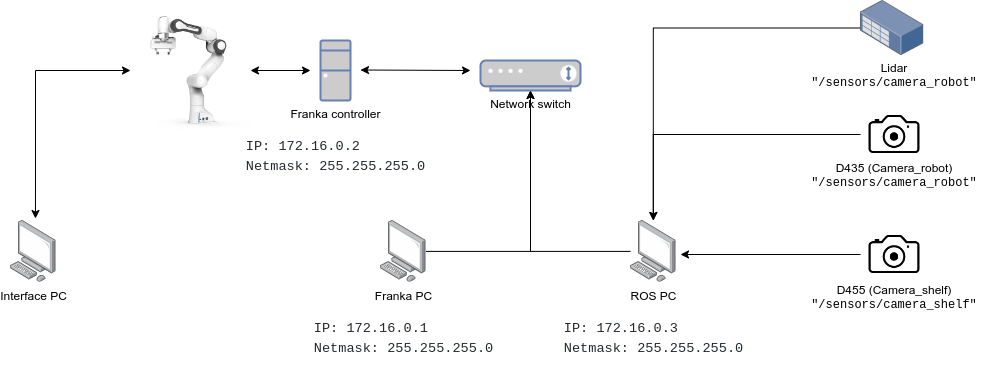

# AAU_franka_moveit

By Albert Daugbjerg Christensen

Aalborg University (2022)

Robotics group

# 1. Description

This repository contains a general MoveIt package for the Franka Emika Panda used for visual reasoning at the AAU robotics lab. The package can then be run on a dedicated PC, used only for communicating with the Franka robot through MoveIt. Other ROS nodes can then communicate with the Franka PC through ROS interfaces.

# 2. Hardware setup

Section 2. describes how to connect all the various hardware and how to install the required software.

This readme file refers to 3 different pc's.

**Franka pc**: The pc for which this code is intended to run. This pc needs to be connected with an ethernet cable to the Franka controller.

**Interface pc**: A pc of any OS that is connected to the Franka robot ethernet port. This pc can acccess the control panel at robot.franka.de

**ROS pc**: The pc for where all the other computations takes place such as visual reasoning, grasping, handover tasks, etc. This pc is also in charge of communicating with the sensors such as microphones, lidars, cameras, etc.

The Franka robot, the 3 PCs and sensors needs to be connected as shown in the figure. **NOTICE** not all network switches are good enough, the robot will simply just not react to any commands if the network is too slow. [Read more here](https://frankaemika.github.io/docs/requirements.html)



## 2.1 (Franka pc) Installation of pre-requisties on the Franka pc (Skip if you have the robolab pc):

The Franka robot requires a real-time kernel patch in order to communicate with any ROS setup. An installation instruction for a dedicated "Franka" pc is therefore given in section 2.1. It is recommended to just use the Robolab pc, if that is not possible, then follow these installation instructions.
These instructions are for installing the neccessary packages on the Franka pc, **NOT** the ROS pc.

### (Franka pc) 2.1.1 General system requirements:
```
PC with ethernet port
Ubuntu 18.04 with real-time patch, instructions for how to install RT patch follows later
```

### 2.1.2 (Franka pc) Install ROS melodic:

Follow the instructions for how to install ros melodic here: http://wiki.ros.org/melodic/Installation/Ubuntu

### 2.1.3 (Franka pc) Build libfranka from source:

The instructions are taken from here: https://frankaemika.github.io/docs/installation_linux.html
Build libfranka from source, do not use the binary

Remove  any existing installations
```
sudo apt remove "*libfranka*"
```

Install pre-requisites
```
sudo apt install build-essential cmake git libpoco-dev libeigen3-dev
```

Clone and setup the installation folder
```
git clone --recursive https://github.com/frankaemika/libfranka # only for panda
cd libfranka
```

Create a build directory and run CMAKE
```
mkdir build && cd build
cmake -DCMAKE_BUILD_TYPE=Release -DBUILD_TESTS=OFF ..
cmake --build .
```

Build a debian package and install the debian package
```
cpack -G DEB
sudo dpkg -i libfranka*.deb
```

### 2.1.4 (Franka pc) Build franka_ros from source:

Setup the catkin workspace
```
cd ~
mkdir -p franka_ros/src && cd franka_ros
source /opt/ros/melodic/setup.sh
catkin_init_workspace src
```

Clone franka_ros github repository
```
git clone --recursive https://github.com/frankaemika/franka_ros src/franka_ros
```

Change version to melodic
```
git checkout melodic-devel
```

Install missing dependencies
```
rosdep install --from-paths src --ignore-src --rosdistro melodic -y --skip-keys libfranka
catkin_make -DCMAKE_BUILD_TYPE=Release -DFranka_DIR:PATH=/path/to/libfranka/build
source devel/setup.sh
```

### 2.1.5 (Franka pc) Install real-time patch:

Setup a workspace
```
cd ~
mkdir rt_patch && cd rt_patch
```

Follow the instructions from here and install the RT patch for kernel version 5.4.19. Other patches might work as well, but bugs and problems have been encountered.

## 2.2. (Franka pc) Install the AAU_franka_moveit repository:

After having installed the pre-requisites on the Franka pc, the moveit package given in this repository needs to be installed. Notice this package also needs to be installed on the ROS pc since it contains some service messages that is required for communicating between the Franka and ROS pc, but that is described further later on.

### 2.2.1 (Franka pc) Install packages:

Install the following ros packages.

#### ROS packages:

```
sudo apt install ros-melodic-moveit
sudo apt install ros-melodic-panda-moveit-config
sudo apt install ros-melodic-realsense2-description
```

#### Other packages:

```
sudo apt install python3-pip
```

### Python packages:

```
pip3 install rospkg
```

### 2.2.2 (Franka pc) Setup the ros workspace:

```
cd ~
mkdir ros_ws
mkdir ros_ws/src
cd ros_ws/src

git clone --branch melodic-devel https://github.com/frankaemika/franka_ros.git
git clone https://github.com/justagist/franka_panda_description.git
git clone --branch v0.7.1-dev https://github.com/justagist/franka_ros_interface.git
git clone https://github.com/HuchieWuchie/AAU_franka_moveit.git

cd ..
catkin_make
source devel/setup.bash
```

## 2.3 (ROS pc) Setup the ROS pc:

This repository only contain the moveit package for basic robot control, you will need another package to do something meaningful with the robot, as an inspiration you can use the franka handover package:

https://github.com/HuchieWuchie/franka_handover

## 2.4 (Interface pc) Setup the interface pc:

You do not need to do anything.

# 3. Usage

## 3.1 (Interface pc):

For all of the usage case scenarios, remember to activate FCI on the Interface pc, by going to robot.franka.de and unlocking the motors, and then activating FCI.

[Read more here](https://frankaemika.github.io/docs/getting_started.html)

## 3.2 Setup the ROS master and IPs:

The only purpose of the Franka pc is to run the moveit package for basic robot controls, you will therefore most like only launch a ROS launch file on the Franka pc. The rest of the computations will be done on the ROS pc, we therefore need to setup the ROS master on the Franka pc and allow the ROS pc to communicate with the ROS master.

### 3.2.1 (Franka pc):

Connect an ethernet cable from the Franka pc and to a switch.
Connect an ethernet cable from the switch to the Franka controller (not the actual robot).

```
IP: 172.16.0.1
Netmask: 255.255.255.0
```

Export ROS settings
```
export ROS_IP=172.16.0.1
export ROS_MASTER_URI=http://172.16.0.1:11311
```

### 3.2.2 (ROS pc):

Connect an ethernet cable from the ROS pc and to the switch

```
IP: 172.16.0.3
Netmask: 255.255.255.0
```

Export ROS settings
```
export ROS_IP=172.16.0.3
export ROS_MASTER_URI=http://172.16.0.1:11311
```

## 3.3 (Franka PC) Basic moveit package

Launch file, this brings up the basic moveit package, you can move the end-effector around the the RVIZ GUI:

```
source devel/setup.bash
roslaunch panda_arm_moveit_config bringup.launch
```

## 3.4 Basic movement of robot through moveit package through code

This package is meant to run on what we call the Franka pc. When you are running the RT patch, it is not possible to use NVIDIA drivers, it is therefore not possible to run any neural networks. Those networks should be run on an external pc, which we call the ROS pc. The ROS pc can then interface with the Franka PC and thereby the MoveIT package through a ROS service called the moveit_service package included in this repository. The moveit_service provides some basic MoveIT functionality, and can be expanded as needed.

**(Franka PC)**

```
roslaunch panda_arm_moveit_config bringup_moveit.launch
```

**(Franka PC or ROS PC)**

An example of how to move and control the Franka robot useing this service is provided in usage_example.py run it by, this node can be run from either the ROS pc or the Franka PC.

```
roslaunch fh_moveit_service usage_example.py
```

## 3.5 How to use sensors

The URDF describes 3 sensors:

An intel realsense d435 mounted on the robot gripper

An intel realsense d455 mounted on the metal frame

A Lidar scanner mounted on the metal frame

This section describes how to interface with the various sensors

**(Franka PC)**

On the Franka pc run the following:

```
roslaunch panda_arm_moveit_config bringup_moveit.launch
```

**(ROS PC)**

Code and ROS services for interfacing the various sensors can be found at https://github.com/HuchieWuchie/franka_handover

## 3.6 How to grasp

This section shows how grasps can be generated through sensor readings and how they can be executed on the physical Franka robot.

**(Franka PC)**

On the Franka pc run the following:

```
roslaunch panda_arm_moveit_config bringup_moveit.launch
```

**(ROS PC)**

Code and ROS services for generating and executing grasps can be found at https://github.com/HuchieWuchie/franka_handover

## 3.7 How to perform a handover

This section shows how task-oriented grasps can be generated through sensor readings and how they can be executed on the physical Franka robot, as well as locating the receiver and moving the handover object to the receiver.

**(Franka PC)**

On the Franka pc run the following:

```
roslaunch panda_arm_moveit_config bringup_moveit.launch
```

**(ROS PC)**

Code and ROS services for performing a handover can be found at https://github.com/HuchieWuchie/franka_handover

# 4. Further development and nice to know

The workspace is described in the ws_description package. You can add additional sensors and environmental description in the ws_description/urdf/panda_arm_hand.urdf.xacro file.

## 4.1 

More general nice to information can be found here:

https://frankaemika.github.io/docs/overview.html
https://frankaemika.github.io/docs/libfranka.html

# 5. Trouble shooting

Todo

## 5.1 Reflex mode

bringup_moveit.launch or bringup.launch launches successfully, but the robot wont move, even though the planning works.

Check if you get the following error in the terminal:

"libfranka move command rejected: command not possible in the current mode ("Reflex")"
- If so, shut down the roscore, press down and unpress the Franka activation button, then restart ROS.

## 5.2 Goal tolerance violated

The robot does not execute any trajectories generated by moveit for whatever reason:

Error:

```
Controller position_joint_trajectory_controller failed with error GOAL_TOLERANCE_VIOLATED:
```

Can sometimes be fixed by either restarting the roscore or in other cases you have to restart the whole robot.
But this should probably be fixed in moveit.
