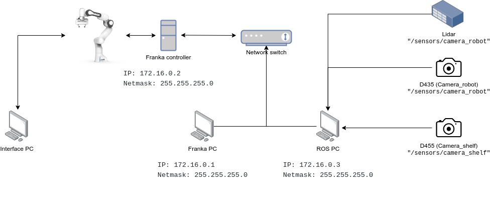

Installation
===================================

This section covers how to install and setup the **Interface PC**, **ROS PC** and 
the **Franka PC**

Requirements
-----------

.. code-block:: RST

    * Interface PC: Any pc with an ethernet port
    * ROS PC: Ethernet port and capable NVidia GPU (preferably 8 GB VRAM)
    * Franka PC: Ethernet port, Ubuntu with PREEMPT_RT patched kernel

Connecting the hardware
----------------------

Start by connecting all the hardware together as shown in the the diagram.

.. code-block:: RST

    * Connect the Interface PC to the base of the robot
    * Connect the Franka controller to the robot, look at Franka manual
    * Connect a network switch to the Franka controller
    * Connect the Franka PC to the network switch
    * Connect the ROS PC to the network switch 
    * Connect peripherals such as sensors (Lidar, camera, etc.) to ROS pc.

Interface PC: Installation
--------

Nothing is required, you can check that the connection to the robot works by
accessing robot.franka.de from either Chrome or Firefox.

You can access the robot with the following login information:

Username: Panda
Password: panda1234

Franka PC: Installation

dd

