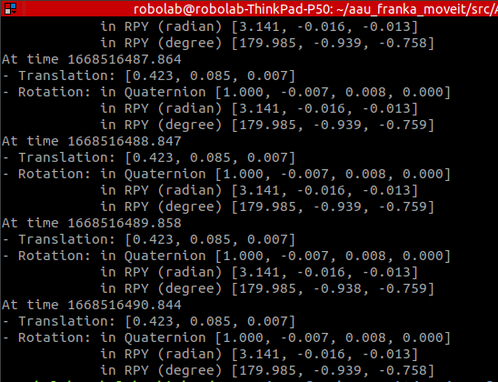

4 Grasping offline
===================================

Needed equipment:
#####

    | ROS PC
    | Interface PC
    | Franka PC

From the ``AAU_franka_moveit`` repository::

    **panda_arm_moveit_config** # MoveIt configuration of the workspace
    **ws_description** # Used by MoveIt to describe the physical workspace
    **moveitService** # Used to send goal poses for the robot from the ROS PC to the MoveIt package on the Franka PC.

Description
######

This tutorial demonstrates how we can find some predefined poses to go to, and
and then grasp an object.
The tutorial will at first show how we read the pose of the end-effector, when
we have moved the robot to a certain configuration, once the end-effector pose
is saved, we can tell the robot to go there using the ``moveitService``.
Finally we can command the robot to perform a grasp action. It is important to
understand, that we cannot simply call the ``moveit.gripperClose()`` function,
as that will mess with MoveIt, and we won't be able to open the gripper using the
``moveitService``. Instead we have to use the ``moveit.Grasp()`` function.
However, that function requires us to know the width which we want to grasp.

``moveit.Grasp()`` is a helper function that makes it easier to call a ROS action
defined in ``franka_ros``. You can read more about the original function here: https://frankaemika.github.io/docs/franka_ros.html#franka-gripper
 we are just calling the ``franka_gripper::GraspAction(width, epsilon_inner, epsilon_outer, speed, force)``.

**NOTE:** According to the documentation, we should be able to grasp an object
with up to 140 Newtons, however, observations from real life leaves a lot to be
desired.

For a overview of the system in this tutorial, see figure below.

.. image:: images/moveit_code.png
  :width: 800
  :alt: Alternative text

Step-by-step:
######

Interface PC::
*******

Perform the following steps on the Interface PC::

    1. Connect to `robot.franka.de`
    2. Unlock brakes
    3. Activate FCI

Franka PC:
*******

Navigate to the ``AAU_franka_moveit`` workspace, wherever you have located it.

Setup the ROS network parameters::

    export ROS_IP=172.16.0.1
    export ROS_MASTER_URI=http://172.16.0.1:11311

Source the work environment::

    source devel/setup.bash

Launch the base moveit launch file::

    roslaunch panda_arm_moveit_config aau_bringup.launch

We start by moving the robot to a position where we want to grasp. So put the
robot in hand-guided mode, and move the robot to a position.

Record the position using ``tf``. Therefore, in another terminal run::

    rosrun tf tf_echo world panda_arm_ee_link

You should get an output like the image below

We will use this output in our grasping application on the ROS pc.

Put the robot back into automatic mode and restart the ros core.

Launch the base moveit launch file::

    roslaunch panda_arm_moveit_config aau_bringup.launch

ROS PC:
********

Navigate to the ROS workspace, wherever you have located it.

Setup the ROS network parameters::

    export ROS_IP=172.16.0.3
    export ROS_MASTER_URI=http://172.16.0.1:11311

Source the work environment::

    source devel/setup.bash

The full code is in the file:

``fh_handover/scripts/examples/demo_grasping_offline.py``

and it can be run by running the following command::

    rosrun fh_handoverdemo_grasping_offline.py

The full code is shown here, it is very similar to the moveit with code example::

  #!/usr/bin/env python3
  import rospy
  import rospkg

  import numpy as np
  import moveit_msgs
  import geometry_msgs
  from moveit_msgs.srv import GetPositionIK
  from moveit_msgs.msg import RobotTrajectory

  import fhMoveitUtils.moveit_utils as moveit

  from fh_moveit_service.srv import moveitMoveToNamedSrv, moveitMoveToNamedSrvResponse
  from fh_moveit_service.srv import moveitPlanToNamedSrv, moveitPlanToNamedSrvResponse
  from fh_moveit_service.srv import moveitPlanFromPoseToPoseSrv, moveitPlanFromPoseToPoseSrvResponse
  from fh_moveit_service.srv import moveitMoveToPoseSrv, moveitMoveToPoseSrvResponse
  from fh_moveit_service.srv import moveitExecuteSrv, moveitExecuteSrvResponse
  from fh_moveit_service.srv import moveitRobotStateSrv, moveitRobotStateSrvResponse
  from fh_moveit_service.srv import moveitPlanToPoseSrv, moveitPlanToPoseSrvResponse
  from fh_moveit_service.srv import moveitGetJointPositionAtNamed, moveitGetJointPositionAtNamedResponse
  from fh_moveit_service.srv import moveitGripperCloseSrv, moveitGripperCloseSrvResponse
  from fh_moveit_service.srv import moveitGripperOpenSrv, moveitGripperOpenSrvResponse

  if __name__ == "__main__":

    rospy.init_node('aau_moveit_usage_example', anonymous=True)

    # Set planning parameters
    moveit.setMaxVelocityScalingFactor(0.2)
    moveit.setMaxAcceleratoinScalingFactor(0.2)
    moveit.setPlanningTime(5.0)
    moveit.setNumPlanningAttempts(50)

    # Open the gripper
    moveit.gripperOpen()

    # Move the robot to the predefined ready pose
    moveit.moveToNamed("home")
    moveit.moveToNamed("ready")

    # Plan a trajectory to the grasp pose found using tf_echo

    ## Define a pose (ROS message)

    pose = geometry_msgs.msg.Pose()
    pose.position.x = 0.423
    pose.position.y = 0.085
    pose.position.z = 0.007

    pose.orientation.x = 1
    pose.orientation.y = 0
    pose.orientation.z = 0
    pose.orientation.w = 0

    ## Compute the trajectory and execute it

    success, trajectory = moveit.planToPose(pose)
    print("Found trajectory: ", success)

    if success:
        moveit.executeTrajectory(trajectory)

    # Grasp the object

    moveit.grasp(width = 0.025, speed = 0.1, force = 140, epsilon_outer=0.01, epsilon_inner=0.01)

    # Move the grasped object 10 cm up

    pose.position.z += 0.1

    success, trajectory = moveit.planToPose(pose)
    print("Found trajectory: ", success)

    if success:
        moveit.executeTrajectory(trajectory)

    # Put it down again

    pose.position.z += -0.1

    success, trajectory = moveit.planToPose(pose)
    print("Found trajectory: ", success)

    if success:
        moveit.executeTrajectory(trajectory)

    # Release the object

    moveit.gripperOpen()

    ## Finally move back to home pose
    moveit.moveToNamed("home")
