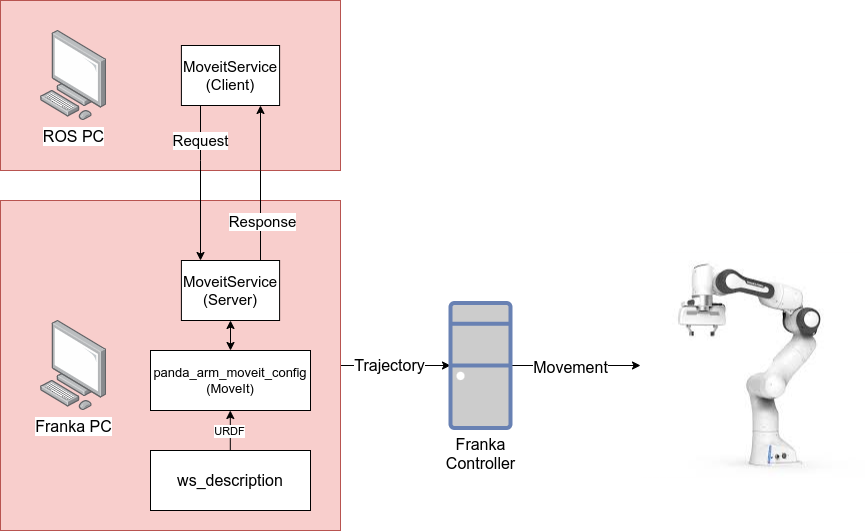

2 Moveit Using code
===================================

Needed equipment:
#####

    | Franka PC
    | ROS PC
    | Interface PC

Packages used
#####

From the ``AAU_franka_moveit`` repository::

    **panda_arm_moveit_config** # MoveIt configuration of the workspace
    **ws_description** # Used by MoveIt to describe the physical workspace
    **moveitService** # Used to send goal poses for the robot from the ROS PC to the MoveIt package on the Franka PC. 

Description
######

This tutorial describes how we can make the movements and trajectories that we
did with the MoveIT GUI, but this time through code. We command the robot using
MoveIt as before. The commands will originate from the **ROS PC** but be executed
by the **Franka PC**. The communication between the **ROS PC** and the **Franka PC**
happens via a ``ROS service``. The service server is hosted on the **Franka PC** 
and the **ROS PC** runs the client which can make requests.

The client can be coded in either ``C++`` or ``Python``, this tutorial is ``Python``
only.

For a overview of the system in this tutorial, see figure below.

Step-by-step:
######

Interface PC::
*******

Perform the following steps on the Interface PC::

    1. Connect to `robot.franka.de`
    2. Unlock brakes
    3. Activate FCI

Franka PC:
*******

Navigate to the ``AAU_franka_moveit`` workspace, wherever you have located it.

Setup the ROS network parameters::

    export ROS_IP=172.16.0.1
    export ROS_MASTER_URI=http://172.16.0.1:11311

Source the work environment::

    source devel/setup.bash

Launch the base moveit launch file::

    roslaunch panda_arm_moveit_config aau_bringup.launch

ROS PC:
********

Navigate to the ROS workspace, wherever you have located it.

Setup the ROS network parameters::

    export ROS_IP=172.16.0.3
    export ROS_MASTER_URI=http://172.16.0.1:11311

Source the work environment::

    source devel/setup.bash

The full code is in the file:

``ros_ws/src/AAU_franka_moveit/fh_moveit_service/usage_example.py``

and it can be run by running the following command::

    rosrun fh_moveit_service usage_example.py

The code is presented here::

    #!/usr/bin/env python3
    import rospy

    import moveit_msgs
    import geometry_msgs
    from moveit_msgs.srv import GetPositionIK
    from moveit_msgs.msg import RobotTrajectory

    import fhMoveitUtils.moveit_utils as moveit

    # import all of our ros service request/respond messages
    from fh_moveit_service.srv import moveitMoveToNamedSrv, moveitMoveToNamedSrvResponse
    from fh_moveit_service.srv import moveitPlanToNamedSrv, moveitPlanToNamedSrvResponse
    from fh_moveit_service.srv import moveitPlanFromPoseToPoseSrv, moveitPlanFromPoseToPoseSrvResponse
    from fh_moveit_service.srv import moveitMoveToPoseSrv, moveitMoveToPoseSrvResponse
    from fh_moveit_service.srv import moveitExecuteSrv, moveitExecuteSrvResponse
    from fh_moveit_service.srv import moveitRobotStateSrv, moveitRobotStateSrvResponse
    from fh_moveit_service.srv import moveitPlanToPoseSrv, moveitPlanToPoseSrvResponse
    from fh_moveit_service.srv import moveitGetJointPositionAtNamed, moveitGetJointPositionAtNamedResponse
    from fh_moveit_service.srv import moveitGripperCloseSrv, moveitGripperCloseSrvResponse
    from fh_moveit_service.srv import moveitGripperOpenSrv, moveitGripperOpenSrvResponse

    if __name__ == "__main__":

        rospy.init_node('aau_moveit_usage_example', anonymous=True)
        print(moveit.getCurrentState())

        # Set planning parameters
        moveit.setMaxVelocityScalingFactor(0.2)
        moveit.setMaxAcceleratoinScalingFactor(0.2)
        moveit.setPlanningTime(1.0)
        moveit.setNumPlanningAttempts(25)

        # Control the gripper in a binary fashion
        moveit.gripperClose()
        moveit.gripperOpen()

        # Move the robot using pre-defined poses
        moveit.moveToNamed("ready")
        moveit.moveToNamed("camera_ready_1")
        moveit.moveToNamed("ready")
        moveit.moveToNamed("home")

        # Plan a trajectory to a pose given as consisting of a position and a quaternion

        ## Define a pose (ROS message)

        pose = geometry_msgs.msg.Pose()
        pose.position.x = 0.299
        pose.position.y = 0.01
        pose.position.z = 0.490

        pose.orientation.x = 0.516
        pose.orientation.y = 0.574
        pose.orientation.z = 0.445
        pose.orientation.w = -0.455

        ## Compute the trajectory and execute it

        success, trajectory = moveit.planToPose(pose)
        print("Found trajectory: ", success)
        
        if success:
            moveit.executeTrajectory(trajectory)

        ## Finally move back to home pose
        moveit.moveToNamed("home")

