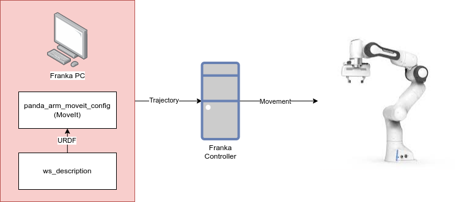

1 MoveIt using GUI
===================================

Needed equipment:
#####

    Franka PC
    Interface PC

Packages used
#####

From the ``AAU_franka_moveit`` repository::

    panda_arm_moveit_config # MoveIt configuration of the workspace
    ws_description # Used by MoveIt to describe the physical workspace

Description
######

This tutorial briefly describe how to launch the barebone MoveIt pacakge that 
allows us to control the Franka Robot, for which the rest of the codebase builds
upon. It also launches an RVIZ gui which allows us to make some simple motion 
commands.

We make use of two packages contained in the ``AAU_franka_moveit`` repository. The
``ws_description`` contains various Xacro and URDF files which describes the
workspace, and the relative transformations between the various objects. Anything
not described here will not be known by the robot, and as such it might collide
with whatever is not described. The ``panda_arm_moveit_config`` can go to various
poses which can be predefined or defined here. The package can then compute a
collision free trajectory and command the robot to execute said trajectory.

For a overview of the system in this tutorial, see figure below.

Step-by-step:
######

Interface PC:
*******

    1. Connect to `robot.franka.de`
    2. Unlock brakes
    3. Activate FCI

ROS PC:
*******

    