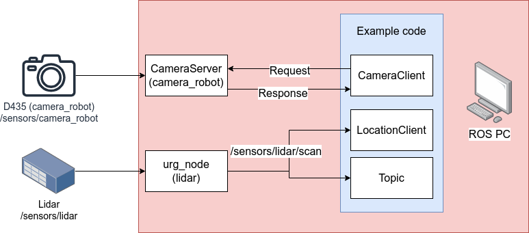

3 Read from sensors
===================================

Needed equipment:
#####

    | ROS PC
    | Interface PC
    | Intel Realsense D435 mounted on the Franka robot
    | URG lidar scanner mounted on the workstation beams

Packages used
#####

From the ``franka_handover`` repository::

    **sensors/camera** # ROS service for interfacing with D435 RGB-D camera
    **handoverLocation** # ROS service for getting estimated receiver position.

From other places::

    **urg_node** # A ROS node for reading from lidar scanner made by the manufacturer.

Description
######

This tutorial describes how to read from the sensors associated with the robotic
system, it also describes how to get the estimated position of the receiver.
We read from the Intel Realsense D435 camera using a ROS service, that means that
there is a server and a client. The server is written in C++ and can be found at
``/sensors/camera/src/realsense_cpp_server.cpp``. The server is intended to get
synchronized data from the camera, it also has a ROS topic for getting a live
feed of the RGB data located at ``/sensors/camera_robot/rgb``.
In order to read from the URG lidar scanner we just make use of a ROS node
provided by the manufacturer. The URG node provides live data on ROS topics.

For a overview of the system in this tutorial, see figure below.

Step-by-step:
######

Interface PC::
*******

Perform the following steps on the Interface PC::

    1. Connect to ``robot.franka.de``
    2. Unlock brakes
    3. Activate FCI

ROS PC::
*******

Source the work environment::

    source devel/setup.bash

Modify the permissions for the laser scanner::

    sudo chmod a+rw /dev/ttyACM0

Launch the ROS services using this launch file::

    roslaunch fh_handover fh_sensor_tutorial.launch

In another terminal run the example code::

    rosrun fh_handover demo_read_sensors.py

Code breakdown:
######

We import the relevant packages::

    #!/usr/bin/env python3

    import sys
    import rospy
    from fh_sensors_camera.srv import *
    import numpy as np
    import cv2
    import open3d as o3d
    from cv_bridge import CvBridge
    from cameraService.cameraClient import CameraClient
    from sensor_msgs.msg import LaserScan
    from locationService.client import LocationClient

Start the ROS node::

    if __name__ == "__main__":
        rospy.init_node("realsense_client_usage_example", anonymous=True)
        rate = rospy.Rate(5)

We have programmed a helper class for using the ROS service associated with the
camera client. In this tutorial we are going to be interfacing with the
``camera_robot`` mounted on the flange of the Franka robot. If you want to read
from the camera mounted on the beam of the workstation you should replace the
keyword ``type`` with ``camera_shelf`` when instantiating the ``CameraClient`` class.

We initialize the ``CameraClient``::

        cam_robot = CameraClient(type = "camera_robot")

The camera only updates information when it is told to ``captureNewScene()``
that means you can always read data at the time when ``captureNewScene`` was called::

        cam_robot.captureNewScene()

We get the RGB information::

        img_rgb = cam_robot.getRGB()
        cv2.imshow("rgb image", img_rgb)
        cv2.waitKey(0)
        cv2.destroyAllWindows()

We can get the geometric point cloud information (no color)::

        cloud, _ = cam_robot.getPointCloudStatic()
        pcd = o3d.geometry.PointCloud()
        pcd.points = o3d.utility.Vector3dVector(cloud)
        o3d.visualization.draw_geometries([pcd])

We can also get the color data associated with the point cloud, it comes as a list
equal to the length of the list with geometric information. **NOTE:** The rgb
information sometimes fails and you will instead get a grey point cloud, I have
yet to fix that bug.::

        cloud, rgb = cam_robot.getPointCloudStatic()
        pcd = o3d.geometry.PointCloud()
        pcd.points = o3d.utility.Vector3dVector(cloud)
        pcd.colors = o3d.utility.Vector3dVector(rgb)
        o3d.visualization.draw_geometries([pcd])

If you want to find the depth information of a certain pixel you need to make
use of the UV information, you can get the UV information like this::

        uv_data = cam_robot.getUvStatic()

We can get the estimated receiver position by doing a coarse median filter of
the lidar scan data::

        locClient = LocationClient()
        location = locClient.getLocation()
        print(location)

If you want access to the live feed from the URG lidar scanner, read from the
ROS topic.

Make a callback function::

    def laserscanCallback(msg):
        scan = msg.ranges
        angle_min = msg.angle_min
        angle_increment = msg.angle_increment

        print(scan)
        print(angle_min)
        print(angle_increment)

Now declare a ROS topic and read from it for 1 second::

        rospy.Subscriber("/sensors/lidar/scan", LaserScan, laserscanCallback)
        i = 0

        while i < 5:
            rate.sleep()
            i += 1

The code:
######

The full code is located at ``fh_handover/scripts/examples/demo_read_sensors.py``
and presented here::

    #!/usr/bin/env python3

    import sys
    import rospy
    from fh_sensors_camera.srv import *
    import numpy as np
    import cv2
    import open3d as o3d
    from cv_bridge import CvBridge
    from cameraService.cameraClient import CameraClient
    from sensor_msgs.msg import LaserScan
    from locationService.client import LocationClient

    def laserscanCallback(msg):
        scan = msg.ranges
        angle_min = msg.angle_min
        angle_increment = msg.angle_increment

        print(scan)
        print(angle_min)
        print(angle_increment)

    if __name__ == "__main__":

        print("Starting")

        rospy.init_node("realsense_client_usage_example", anonymous=True)
        rate = rospy.Rate(5)

        #############################################################################################################################

        # Capture information from camera mounted on robot
        cam_robot = CameraClient(type = "camera_robot")

        # The camera only updates information when it is told to captureNewScene() otherwise all informaiton is static

        cam_robot.captureNewScene()

        img_rgb = cam_robot.getRGB()
        cv2.imshow("rgb image", img_rgb)
        cv2.waitKey(0)

        # Get the point cloud

        cloud, _ = cam_robot.getPointCloudStatic()
        pcd = o3d.geometry.PointCloud()
        pcd.points = o3d.utility.Vector3dVector(cloud)
        o3d.visualization.draw_geometries([pcd])

        # Get a colored point cloud

        cloud, rgb = cam_robot.getPointCloudStatic()
        pcd = o3d.geometry.PointCloud()
        pcd.points = o3d.utility.Vector3dVector(cloud)
        pcd.colors = o3d.utility.Vector3dVector(rgb)
        o3d.visualization.draw_geometries([pcd])

        cv2.destroyAllWindows()

        ##############################################################################################################################

        # Lidar scanner

        # Get the estimated position of the receiver
        locClient = LocationClient()
        location = locClient.getLocation()
        print(location)

        rospy.sleep(3)

        # get raw sensor readings through a topic
        rospy.Subscriber("/sensors/lidar/scan", LaserScan, laserscanCallback)
        i = 0

        while i < 5:
            rate.sleep()
            i += 1
